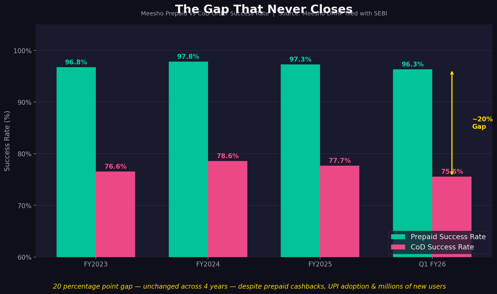

# Meesho CoD Trust Analysis
**Retail Analytics Portfolio Project · Vishal · IIT Madras BS Data Science**

---

## The Question
Meesho has 75–88% Cash on Delivery orders.
Prepaid success rate is 97%. CoD success rate is 77%.

**Why do customers choose the less reliable option?**

---

## The Finding
CoD is not a payment preference.
It is rational self-protection by customers who lost money
to prepaid failures and received no resolution.

> *"maine is pr trust Kiya online payment karke...
> hamara payment aur trust dono hi gaye"*
> — Real Meesho customer, scraped from Google Play Store

---

## The Argument — How the Data Connects

**Step 1 — The gap exists and is structural**
Meesho's Pre-Filed DRHP filed with SEBI shows a 20 point gap
between prepaid (97%) and CoD (77%) success rates —
unchanged across four financial years despite active prepaid incentive programs.
If CoD dominance were habit, incentives would have fixed it. They have not.

**Step 2 — Payment infrastructure actually failed**
The same DRHP confirms three platform outages in seven months:
November 2024 · April 2025 · May 5 2025.
On May 5, Meesho temporarily disabled prepaid entirely
due to a payment gateway failure.

**Step 3 — Customers confirm it in their own words**
133,300 Play Store reviews scraped and analysed.
23.5% of 23,149 negative reviews mention financial complaints
— refund delays, money deducted, payment failures, fraud.
This is the second highest complaint category after delivery.
480 reviews cite fraud specifically alongside payment or refund failure.

**Step 4 — The core customer makes this catastrophic**
Meesho's core customer is a first time e-commerce user
in a tier 2+ city making ₹200–300 purchases.
85% of UPI transactions in India are below ₹500 (NPCI data · Redseer report).
For this customer one failed payment is their entire week's
discretionary budget. Trust threshold is low. Recovery time is long.

**Step 5 — CoD is the outcome, not the cause**
CoD floor stuck at 75% is not a preference problem.
It is a permanent record of every customer Meesho failed
and never recovered.

---

## Data Sources
| Source | What it provided |
|--------|-----------------|
| Meesho Pre-Filed DRHP · SEBI | CoD %, success rates, platform outages |
| Redseer Industry Report 2025 | Customer profile, UPI transaction data |
| Google Play Store · Self-scraped | 133,300 reviews · Oct 2025 – May 2026 |

---

## Key Numbers
- **23,149** negative reviews analysed
- **23.5%** mention financial issues — 2nd highest complaint category
- **480** reviews cite fraud alongside payment or refund failure
- **20 point gap** — prepaid vs CoD success rate — unchanged in 4 years
- **3 platform outages** confirmed in Meesho's own SEBI filing

---

## Recommendation
Three segments. Three different interventions.

| Segment | Problem | Intervention |
|---------|---------|-------------|
| First time buyers | No trust signals at checkout | Payment guarantee badge · Instant SMS confirmation · Real time money tracker |
| Bad experience returners | Trust already destroyed | Proactive 24hr refund · Scheduled callback · Service recovery credit |
| Habitual CoD users | Habit not trauma | First prepaid cashback · Prepaid-only flash sale access |

---

## Visuals

---

## How to Run
pip install google-play-scraper pandas matplotlib
python meesho_cod_analysis.py
